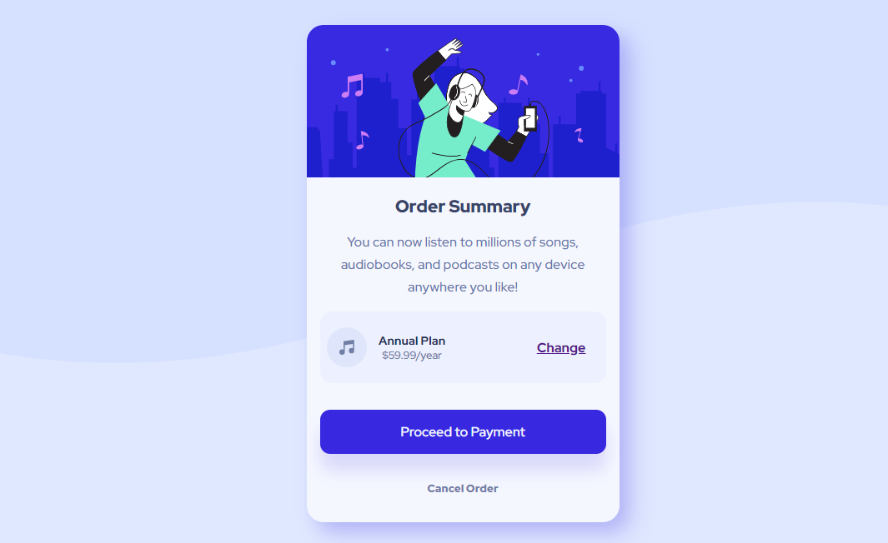

# Frontend Mentor - Order summary card solution

This is a solution to the [Order summary card challenge on Frontend Mentor](https://www.frontendmentor.io/challenges/order-summary-component-QlPmajDUj). Frontend Mentor challenges help you improve your coding skills by building realistic projects. 

## Overview

### The challenge

Users should be able to:

- See hover states for interactive elements

### Screenshot

### Links

- Solution URL: [Add solution URL here](https://your-solution-url.com)
- Live Site URL: [Add live site URL here](https://your-live-site-url.com)

## My process

### Built with

- Semantic HTML5 markup
- CSS custom properties
- Flexbox
- Mobile-first workflow

### What I learned

I learn how to use flexbox, relative units: rem, em.
pricing parts was little bit hard but i broke through
### Continued development
layouts to different screen size
navigations 

### Useful resources

- [Example resource 1](https://www.kevinpowell.co) - Kevin Powell made me understand how to use flexbox relative units eg. rems and ems when  i enrolled his course on responsive web design on (scrimba.com)
- [Example resource 2](https://www.freecodecamp.org) - This is an amzing site to learn frontend webdev i learn alot and i am here on frontendmentor to practice building real life project

## Author

- Website - [mohamed taha nassir](https://www.your-site.com)
- Frontend Mentor - [@LONEWOLF143](https://www.frontendmentor.io/profile/LONEWOLF143)
- Twitter - [@loonewolf143](https://twitter.com/loonewolf143)

## Acknowledgments

i am very glad to get the tip to design pricing section on freecodecamp.com on flexbox on twitter header i got the idea in there